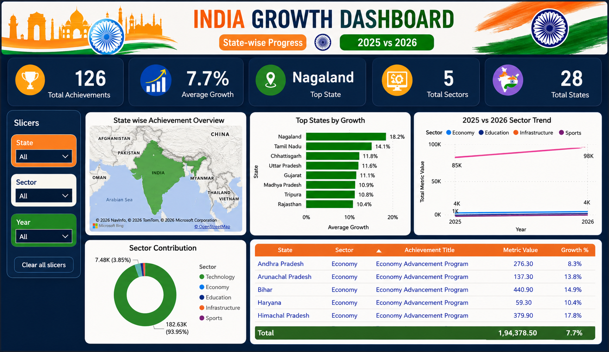

# 🇮🇳 India Growth Dashboard

## 📌 Project Overview

The **India Growth Dashboard** is an interactive Power BI project developed to analyse and compare the state-wise and sector-wise growth of India between **2025 and 2026**.

The dashboard converts raw achievement data into meaningful insights using KPI cards, charts, an India map, slicers, and a detailed performance table.

---

## 🎯 Project Objectives

- Analyse state-wise development performance.
- Compare performance between 2025 and 2026.
- Identify the highest-growing Indian states.
- Analyse the contribution of different development sectors.
- Measure the overall average growth percentage.
- Build an interactive and user-friendly Power BI dashboard.
- Present India’s progress through effective data storytelling.

---

## 📊 Dashboard Preview



> Create an `images` folder in your repository and upload your dashboard image with the name `india-growth-dashboard.png`.

---

## 📈 Key Performance Indicators

| KPI | Result |
|---|---:|
| Total Achievements | 126 |
| States Covered | 28 |
| Development Sectors | 5 |
| Average Growth | 7.7% |
| Top-Performing State | Nagaland |
| 2025 Metric Value | 85K |
| 2026 Metric Value | 98K |

---

## 🔍 Key Insights

- **Nagaland** recorded the highest growth rate at approximately **18.2%**.
- **Tamil Nadu** ranked second with approximately **14.1% growth**.
- The overall average growth across the analysed records was **7.7%**.
- The main performance metric increased from approximately **85K in 2025** to **98K in 2026**.
- The analysis covers **126 achievements** across **28 Indian states**.
- Five major development sectors were included in the analysis.
- Interactive slicers allow users to analyse the results by state, sector, and year.

---

## 🖥️ Dashboard Features

The dashboard contains the following visuals:

- Total Achievements KPI Card
- Total States KPI Card
- Total Sectors KPI Card
- Average Growth KPI Card
- Top-Performing State KPI Card
- State-wise India Map
- Top States by Growth Bar Chart
- Sector Performance Comparison Chart
- Sector Contribution Chart
- 2025 vs 2026 Performance Trend
- Achievement Details Table
- State, Sector, and Year Slicers

---

## 🛠️ Tools and Technologies

- **Microsoft Excel** – Data collection and initial preparation
- **Power Query** – Data cleaning and transformation
- **Microsoft Power BI** – Data modelling and dashboard creation
- **DAX** – KPI calculations and analytical measures
- **GitHub** – Project documentation and version control

---

## 🧹 Data Cleaning and Preparation

The following data-preparation operations were performed:

1. Checked the dataset for duplicate records.
2. Handled blank and missing values.
3. Standardised state and sector names.
4. Corrected inconsistent data types.
5. Formatted the year and metric columns.
6. Validated the 2025 and 2026 values.
7. Verified the growth percentage calculations.
8. Created calculated columns and DAX measures.
9. Checked state names to ensure correct map visualisation.
10. Loaded the cleaned dataset into Power BI.

---

## 🔄 Project Workflow

```text
Data Collection
      ↓
Data Cleaning in Excel and Power Query
      ↓
Data Transformation
      ↓
Power BI Data Modelling
      ↓
DAX Measure Creation
      ↓
Dashboard Development
      ↓
Insight Generation
      ↓
Project Documentation
```

---

## 🧮 Sample DAX Measures

### Total Achievements

```DAX
Total Achievements =
COUNTROWS('India Achievements')
```

### Total States

```DAX
Total States =
DISTINCTCOUNT('India Achievements'[State])
```

### Total Sectors

```DAX
Total Sectors =
DISTINCTCOUNT('India Achievements'[Sector])
```

### Average Growth Percentage

```DAX
Average Growth % =
AVERAGE('India Achievements'[Growth %])
```

### Total Metric Value 2025

```DAX
Total Metric 2025 =
SUM('India Achievements'[Metric Value 2025])
```

### Total Metric Value 2026

```DAX
Total Metric 2026 =
SUM('India Achievements'[Metric Value 2026])
```

### Growth Percentage

```DAX
Growth % =
DIVIDE(
    [Total Metric 2026] - [Total Metric 2025],
    [Total Metric 2025],
    0
)
```

### Top-Performing State

```DAX
Top Performing State =
VAR TopState =
    TOPN(
        1,
        SUMMARIZE(
            'India Achievements',
            'India Achievements'[State],
            "State Growth", [Average Growth %]
        ),
        [State Growth],
        DESC
    )
RETURN
    CONCATENATEX(
        TopState,
        'India Achievements'[State],
        ", "
    )
```

> Change the table and column names if they are different in your Power BI dataset.

---

## 🚀 How to Use the Project

1. Download or clone this GitHub repository.
2. Install **Microsoft Power BI Desktop**.
3. Open the `India_Growth_Dashboard.pbix` file.
4. Update the Excel source location if required.
5. Select **Refresh** to reload the data.
6. Use the State, Sector, and Year slicers to explore the dashboard.
7. Hover over the visuals to view additional information.

---

## 💡 Skills Demonstrated

- Data collection
- Data cleaning
- Data transformation
- Microsoft Excel
- Power Query
- Power BI
- Data modelling
- DAX calculations
- KPI development
- Dashboard designing
- Data visualisation
- Data storytelling
- Insight generation
- GitHub documentation

---

## 📌 Project Conclusion

The India Growth Dashboard provides an interactive overview of state-wise and sector-wise development performance between 2025 and 2026.

The dashboard helps users identify high-performing states, compare yearly performance, understand sector contributions, and explore achievement-level information.

This project demonstrates how Power BI can transform development data into clear, meaningful, and actionable insights.

---

## 👤 Author

**Mohamed Ilyas Mydeen**

Data Analyst | Power BI | Excel | SQL | Python

---

## ⭐ Feedback

If you find this project useful, please give the repository a star.

Feedback and suggestions are always welcome.
